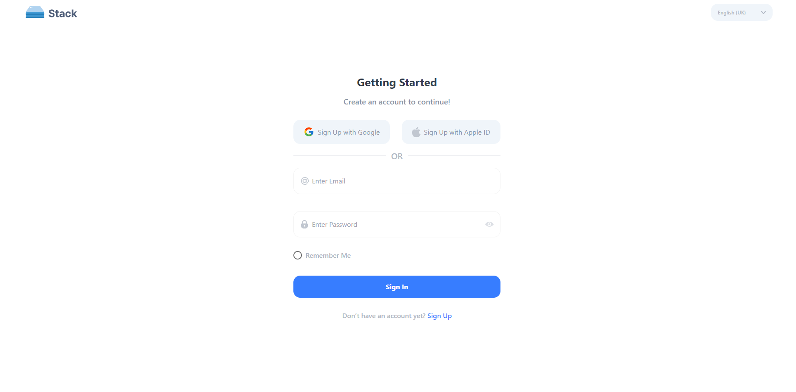

# Project Title

This project is a React application that uses Tailwind CSS for styling and Redux Toolkit for state management. It includes four pages: sign in, sign up, users, and a blank dashboard page. The app also includes an authentication system that integrates with an API and private routes that restrict access to authenticated users. The user list API is integrated with pagination to display a list of users on the users page.

## Live Link

https://simple-react-app-chi.vercel.app/signin

## Screenshots

## Installation

1. Clone the repository
2. Install dependencies using `npm install`
3. Start the app using `npm run dev`

## Usage

1. Sign in or sign up to access the dashboard and users pages
2. Use the pagination on the users page to view more users

## API

This project uses the ReqRes.in API for user authentication and user list data. The API endpoints are as follows:

- POST https://reqres.in/api/register
- POST https://reqres.in/api/login
- GET https://reqres.in/api/users?page=2

## Dependencies

- react
- react-dom
- react-router-dom
- react-redux
- @reduxjs/toolkit
- tailwindcss

## Contributors

- Abu bakkar anir (anirdms@gmail.com)